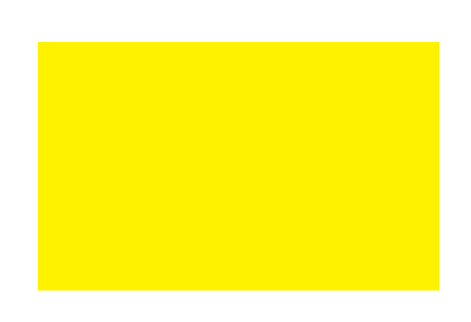
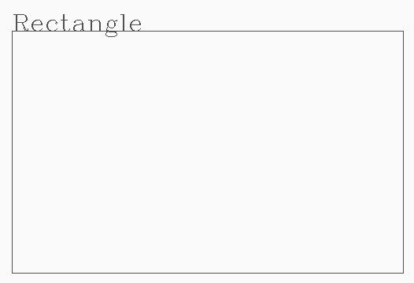
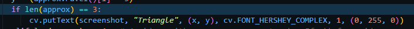
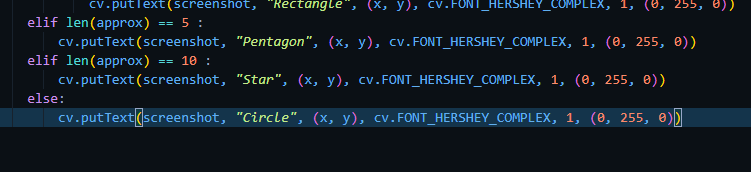
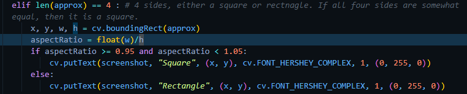
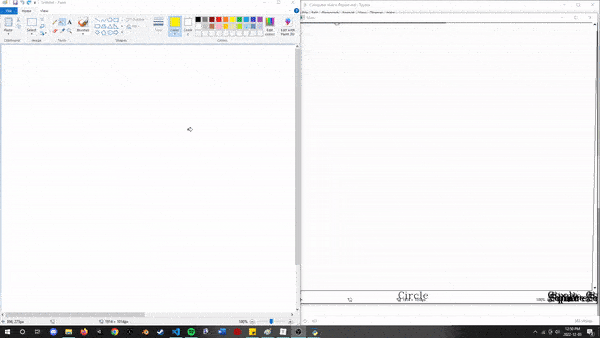
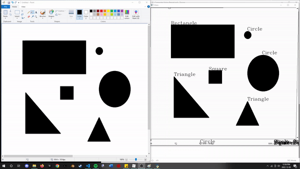
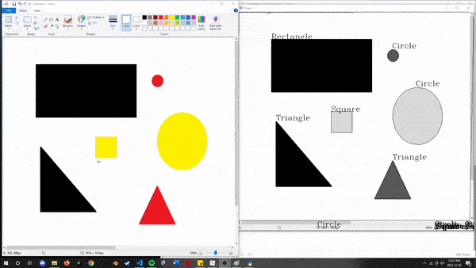

# Shape Detection and Segmentation

The goal with this assignment is to read in real time video data (in this case real time screen capture of the Paint program) and identify various shapes being drawn as well as segment them based on color.

**Setup**

Open the 'Paint' program and have it open on the screen (sometimes an error is thrown when the paint program is minimized).

Run the `main.py` script!

Start drawing in Paint (use predefined shapes for more accuracy)!

#### Step 1 Video Capture

Most of the code to take continuous screenshots directly taken from *https://github.com/learncodebygaming/opencv_tutorials/blob/master/004_window_capture/windowcapture.py*

Works with a low level windows API to continually take screenshots of a specified program/screen, then continually outputs those screenshots which simulates a real-time video feed (minus the lag from the function calls / computation).

#### Step 2 Shape Detection

We are using the `cv.findContours` function to detect the *location* of the shapes in the image.

This function joins all the continuous points together with the same color/intensity and in the final output, will draw a black line around the border of the shape:

Input: 

Output (ignore shape classification for now):

 

In order to achieve more accurate results, I could also further process the image by using canny edge detection, which is an edge detection algorithm. But our simple thresholding seems to do a decent job.

#### Step 3 Shape Identification

Once we have outline the shape, we now must determine what type of shape it is by going through the contours and determining how many sides the shape has.

For the squares / rectangles, since they will each have four sides. We must calculate the aspect ratio of the outline shape. If all four sides are relatively equal, it is a square:

#### Step 4 Image Segmentation (based on shape color)

We are then segmenting the shapes based on pixel color similarity and specifying a k value to group them. Keep in mind, the entire image is being segmented, not just the shapes. So it does segment the background as it's own part. Colors that are similar with be grouped together, especially if K value is low.

#### Demo

Shape Detection

Segmentation / Different K Values

Modifying a Rectangle into triangles and squares

NOTE: This application is obviously very basic. Since we are simply determining shapes based on the number of sides and limiting the shapes to things we have defined in the code, it can only do so much.

